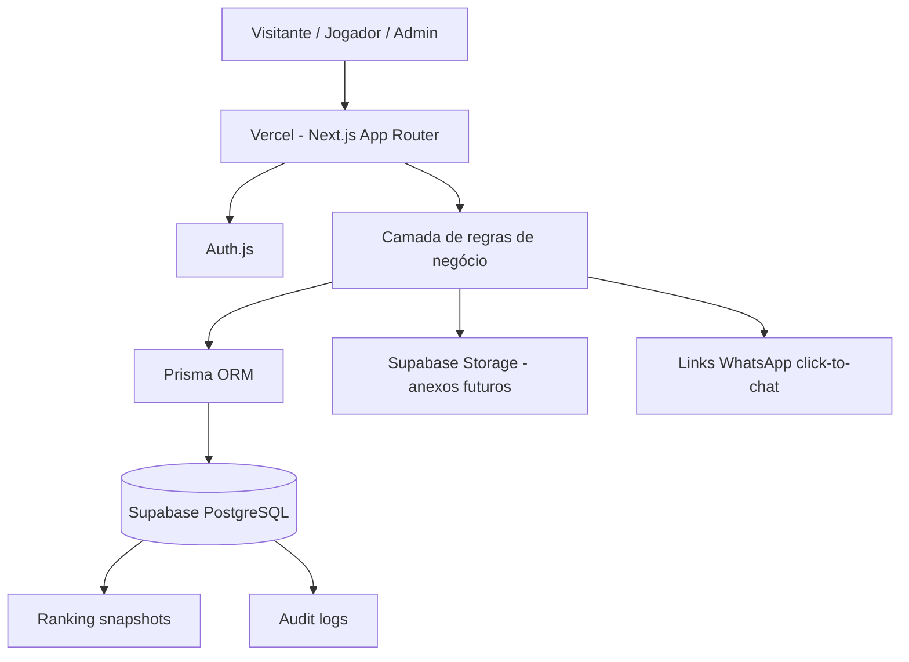

# Fase 0 — Plano técnico do App Liga Zikachu

> **Objetivo:** substituir planilha + macros VBA + Google Forms por um app web/PWA responsivo, multi-temporada, com cálculos confiáveis, auditáveis e revisáveis pelo admin.

---

## 1. Arquitetura geral

### Decisão de arquitetura
- **Frontend + backend BFF no mesmo projeto:** Next.js 14+ App Router com Server Components, Route Handlers e Server Actions.
- **Banco relacional principal:** PostgreSQL hospedado no Supabase.
- **ORM e migrations:** Prisma.
- **Autenticação escolhida:** **Auth.js v5 com Prisma Adapter**.
- **Hospedagem:** Vercel para app, Supabase para Postgres e Storage.
- **PWA:** instalação no Android via navegador, com foco em uso responsivo e ação rápida.

### Justificativa arquitetural
- Centraliza UI, autenticação, regras de negócio e auditoria em uma única aplicação.
- Evita duplicar regra entre frontend e backend externo.
- Facilita cálculo do ranking no servidor, com snapshots e trilha de auditoria.
- Mantém o banco relacional como fonte única da verdade.
- Permite evoluir por fases sem depender de app nativo.

### Diagrama textual



### Princípios técnicos
- **Fonte única da verdade:** ranking exibido sempre deriva de partidas confirmadas, códigos distribuídos e regras versionadas.
- **Auditoria nativa:** toda mutação relevante gera `audit_logs`.
- **Reprocessamento seguro:** ranking pode ser recalculado e comparado com snapshots anteriores.
- **Admin revisável:** confirmações, desafios, códigos e ajustes ficam rastreáveis.
- **Sem setup local pesado:** fluxo principal de teste via deploy público.

---

## 2. Stack final + justificativa

### Stack final
- **App:** Next.js 14+ App Router + TypeScript
- **UI:** Tailwind CSS + shadcn/ui
- **Banco:** PostgreSQL (Supabase)
- **ORM:** Prisma
- **Auth:** **Auth.js v5 + Prisma Adapter**
- **Storage:** Supabase Storage
- **PWA:** `next-pwa` ou equivalente compatível com App Router
- **Validação:** Zod
- **Tabelas e grids:** TanStack Table
- **Formulários:** React Hook Form + Zod Resolver
- **Deploy:** Vercel

### Escolha: Auth.js v5 em vez de Supabase Auth

#### Por que Auth.js é a opção mais simples/estável aqui
- Mantém autenticação, perfis, roles, aprovação e sessão **no mesmo modelo Prisma**.
- Simplifica regras de negócio com **`users.role`** e **`users.status`** sem sincronização paralela entre `auth.users` e tabelas próprias.
- Facilita convites, aprovação manual, super admin e callbacks com enriquecimento de sessão.
- Evita acoplamento prematuro com RLS no banco para regras que já estarão no servidor Next.js.
- Funciona bem com Google + email/senha + recuperação de conta no mesmo fluxo.

#### Por que não escolher Supabase Auth no MVP
- Adiciona integração híbrida entre **Prisma** e **tabelas de auth do Supabase**, elevando a complexidade de modelagem e sincronização.
- RLS é útil, mas não é obrigatória no MVP porque o app já terá backend próprio controlando acesso.
- Convite/aprovação e perfil de jogador tenderiam a exigir lógica adicional fora do fluxo padrão.

---

## 3. Estrutura de pastas

```text
liga-zikachu/
├─ docs/
│  └─ plano-fase-0.md
├─ prisma/
│  ├─ schema.prisma
│  ├─ migrations/
│  └─ seed.ts
├─ public/
│  ├─ icons/
│  ├─ manifest.webmanifest
│  └─ screenshots/
├─ src/
│  ├─ app/
│  │  ├─ (public)/
│  │  │  ├─ login/
│  │  │  └─ recuperar-senha/
│  │  ├─ (app)/
│  │  │  ├─ dashboard/
│  │  │  ├─ jogadores/
│  │  │  ├─ temporadas/
│  │  │  │  └─ [seasonId]/
│  │  │  │     ├─ semanas/
│  │  │  │     ├─ partidas/
│  │  │  │     ├─ ranking/
│  │  │  │     ├─ decks/
│  │  │  │     ├─ codigos/
│  │  │  │     └─ top-do-dia/
│  │  │  ├─ admin/
│  │  │  │  ├─ aprovacoes/
│  │  │  │  ├─ auditoria/
│  │  │  │  ├─ importacoes/
│  │  │  │  └─ configuracoes/
│  │  │  └─ perfil/
│  │  ├─ api/
│  │  │  ├─ auth/
│  │  │  ├─ ranking/
│  │  │  ├─ imports/
│  │  │  └─ whatsapp/
│  │  ├─ layout.tsx
│  │  └─ globals.css
│  ├─ components/
│  │  ├─ ui/
│  │  ├─ forms/
│  │  ├─ ranking/
│  │  ├─ season/
│  │  ├─ matches/
│  │  └─ admin/
│  ├─ lib/
│  │  ├─ auth/
│  │  ├─ prisma/
│  │  ├─ ranking/
│  │  ├─ permissions/
│  │  ├─ whatsapp/
│  │  ├─ csv/
│  │  └─ audit/
│  ├─ server/
│  │  ├─ actions/
│  │  ├─ services/
│  │  ├─ repositories/
│  │  └─ policies/
│  ├─ types/
│  └─ middleware.ts
├─ tests/
│  ├─ smoke/
│  └─ e2e/
├─ package.json
└─ README.md
```

---

## 4. Schema Prisma completo

> O schema implementado está em `prisma/schema.prisma` e cobre:
- `users`
- `players`
- `seasons`
- `season_players`
- `weeks`
- `matches`
- `match_confirmations`
- `deck_submissions`
- `challenges`
- `booster_codes`
- `code_distributions`
- `achievements`
- `player_achievements`
- `ranking_snapshots`
- `audit_logs`
- tabelas de suporte do Auth.js

---

## 5. ER textual

- **User 1:1 Player** — `users` representa conta/autenticação; `players` representa identidade esportiva.
- **Season N:N Player** via `season_players`.
- **Season 1:N Week**.
- **Season 1:N Match** e **Week 1:N Match**.
- **Match 1:N MatchConfirmation**.
- **Season/Week/Player 1:N DeckSubmission**.
- **Match 0:N Challenge** para contestação de resultado.
- **BoosterCode 1:1 CodeDistribution** no fluxo de distribuição efetiva.
- **Achievement N:N Player** via `player_achievements`.
- **Season/Week/Player 1:N RankingSnapshot** para histórico auditável.
- **AuditLog** aponta para entidade lógica por `entityType + entityId`.

---

## 6. Matriz de permissões

| Ação / Perfil | Visitante | Jogador | Admin | Super Admin |
|---|---:|---:|---:|---:|
| Ver landing/login | ✅ | ✅ | ✅ | ✅ |
| Ver ranking público da temporada ativa | ✅ | ✅ | ✅ | ✅ |
| Criar conta | ✅ | ✅ | ✅ | ✅ |
| Entrar com Google / email+senha | ✅ | ✅ | ✅ | ✅ |
| Editar próprio perfil | ❌ | ✅ | ✅ | ✅ |
| Enviar deck próprio | ❌ | ✅ | ✅ | ✅ |
| Reportar resultado | ❌ | ✅ | ✅ | ✅ |
| Confirmar resultado da própria partida | ❌ | ✅ | ✅ | ✅ |
| Abrir contestação | ❌ | ✅ | ✅ | ✅ |
| Ver próprias recompensas/códigos | ❌ | ✅ | ✅ | ✅ |
| Criar temporada | ❌ | ❌ | ✅ | ✅ |
| Cadastrar semanas e confrontos | ❌ | ❌ | ✅ | ✅ |
| Aprovar jogadores | ❌ | ❌ | ✅ | ✅ |
| Aprovar/rejeitar decks | ❌ | ❌ | ✅ | ✅ |
| Importar CSV de códigos | ❌ | ❌ | ✅ | ✅ |
| Distribuir/revogar código | ❌ | ❌ | ✅ | ✅ |
| Escolher/confirmar Top do Dia | ❌ | ❌ | ✅ | ✅ |
| Reprocessar ranking | ❌ | ❌ | ✅ | ✅ |
| Ver auditoria completa | ❌ | ❌ | ✅ | ✅ |
| Gerenciar admins | ❌ | ❌ | ❌ | ✅ |
| Suspender contas | ❌ | ❌ | ❌ | ✅ |

---

## 7. Fluxo de autenticação

### Fluxo principal
1. Usuário entra por **Google** ou **email+senha**.
2. Se for novo cadastro, cria `users.status = PENDING_APPROVAL`.
3. Sistema solicita completar dados mínimos do jogador (`displayName`, `ptcglNick`, `whatsapp`).
4. Admin recebe fila de aprovação.
5. Após aprovação, usuário passa para `ACTIVE` e pode entrar nas temporadas.

### Convite/aprovação
- Admin pode pré-cadastrar convite por email.
- Se o email convidado se registrar, conta cai direto em fila identificada.
- Aprovação registra `approvedById` e gera `audit_logs`.

### Email + senha
- Credentials Provider com senha hasheada.
- Política mínima: 8+ caracteres.
- Recuperação por token enviado por email.

### Google
- Google Provider no Auth.js.
- Se email já existir, faz vinculação segura de conta.

### Recuperação de conta
- Solicitar email.
- Gerar token com expiração.
- Resetar senha e invalidar sessões antigas.

---

## 8. Fluxo do campeonato

### Antes da temporada
- Criar temporada.
- Configurar regras de ranking.
- Cadastrar jogadores participantes (`season_players`).
- Definir semanas, multiplicadores e prazos.
- Importar lote inicial de códigos.

### Durante a temporada
- Jogadores entram, acompanham ranking e agenda.
- Admin cria confrontos semanais.
- Jogadores submetem deck dentro do prazo.

### Dia de jogos
- Partida é registrada por um dos jogadores ou pelo admin.
- Outro jogador confirma.
- Se houver divergência, vira `DISPUTED` e gera `challenge`.
- Partida confirmada entra no cálculo do ranking.

### Fim de semana / fechamento semanal
- Sistema recalcula ranking da semana.
- Admin revisa Top do Dia.
- Sistema identifica pendências: deck faltante, resultado sem confirmação, código não distribuído.

### Fim de temporada
- Gerar snapshot final.
- Congelar classificação.
- Distribuir recompensas finais.
- Arquivar temporada sem perder histórico.

---

## 9. Regras de cálculo do ranking

### Princípio
O ranking sempre deve ser **derivado**, nunca editado manualmente como valor final. Ajustes manuais entram como evento auditável e não como sobrescrita silenciosa.

### Algoritmo proposto para MVP
- **Vitória:** 3 pontos base
- **Empate:** 1 ponto base
- **Derrota:** 0 ponto base
- **BYE:** 3 pontos base
- **Multiplicador da semana:** `pontosBase * weeks.multiplier`
- **Top do Dia:** bônus configurável por semana/temporada

### Desempate recomendado
1. **Pontos totais**
2. **Força de agenda**
3. **Confronto direto**
4. **Número de vitórias**
5. **Menor quantidade de byes**
6. **Ordem manual do admin com log**

### Snapshot de auditoria
Cada reprocessamento gera `ranking_snapshots` com posição, pontos, vitórias, derrotas, empates, hashes da configuração/insumos e `algorithmVersion`.

---

## 10. Regras do Top do Dia

### Entrada
- Janela de apuração por semana ou por data.
- Apenas jogadores com partida confirmada no período entram.

### Critérios sugeridos
1. Mais vitórias confirmadas no período
2. Melhor saldo de jogos
3. Vitória sobre adversário melhor ranqueado
4. Menor número de contestação
5. Desempate manual do admin com justificativa

### Anti-duplicidade
- Um mesmo jogador não pode receber Top do Dia duas vezes no mesmo período.
- Reprocessamento não cria duplicidade.

---

## 11. Regras de códigos de booster

### Estados
- `AVAILABLE`
- `ASSIGNED`
- `REDEEMED`
- `INVALIDATED`
- `EXPIRED`

### Import CSV
Colunas mínimas:
- `code`
- `sourceBatch` (opcional)
- `rewardLabel` (opcional)
- `expiresAt` (opcional)
- `notes` (opcional)

### Regras
- `code` é único.
- Duplicados são recusados e reportados.
- Atribuição exige motivo.
- Toda atribuição/revogação gera log.

---

## 12. Fluxo de envio de deck

- Cada jogador envia o deck da semana antes de `weeks.lockAt`.
- Pode editar até o prazo.
- Após o prazo, edição só por admin ou com flag de atraso.
- Deck pode ser aprovado/rejeitado pelo admin.
- Sistema lista automaticamente quem ainda não enviou.

---

## 13. Plano em fases

## Fase 1 — MVP
- Bootstrap do projeto, shell responsivo e PWA
- Auth.js com Google + email/senha + aprovação
- Schema Prisma, migrations e seed inicial
- CRUD de jogadores, temporadas, semanas e partidas
- Registro e confirmação de resultados
- Ranking automático com snapshots auditáveis
- Envio de deck com prazo
- Importação e distribuição de códigos
- Top do Dia manual assistido
- Geração de mensagens WhatsApp por link

## Fase 2 — Avançado
- Contestação de resultados com resolução completa
- Regras mais flexíveis de ranking
- Painel de auditoria e comparação entre snapshots
- Importação CSV com relatório rico
- Conquistas e histórico por jogador
- Dashboard admin com pendências

## Fase 3 — Polimento
- Melhorias de UX mobile
- Cache offline de leitura
- Exportações e relatórios
- Estatísticas por jogador/semana
- Performance, acessibilidade e observabilidade

---

## 14. Lista exata do MVP

1. **Login**
2. **Jogadores**
3. **Temporadas**
4. **Semanas**
5. **Partidas**
6. **Resultados**
7. **Ranking automático**
8. **Envio de deck**
9. **Códigos**
10. **Top do Dia**
11. **Mensagem WhatsApp**

---

## 15. Riscos técnicos e pontos a validar

- Confirmação entre jogadores sem resposta
- Regra de BYE no ranking
- Import CSV com cabeçalhos/encoding
- RLS fora do MVP inicial
- Preview com banco compartilhado
- Vinculação Google + credentials no mesmo email
- Impacto do Top do Dia e de códigos no ranking
- Deck por semana vs deck por temporada

---

## 16. Seeds

### Temporada
- `Liga Zikachu - Temporada 1`

### Jogadores
- Luiz
- Rodrigo
- Moisés
- Erick
- Cristian
- Nakaima

### Semanas
- Semana 1
- Semana 2
- Semana 3

### Confrontos
- Semana 1: Luiz x Rodrigo, Moisés x Erick, Cristian x Nakaima
- Semana 2: Luiz x Moisés, Rodrigo x Cristian, Erick x Nakaima
- Semana 3: Luiz x Erick, Rodrigo x Nakaima, Moisés x Cristian

### Códigos
- 8 a 12 códigos de exemplo
- 2 distribuídos
- 1 resgatado
- 1 invalidado

---

## 17. Primeiras 5-7 telas com wireframe textual

## 1. Login / entrada
```text
+--------------------------------------------------+
| Liga Zikachu                                     |
| [ Entrar com Google ]                            |
| Email [____________________]                     |
| Senha [____________________]                     |
| [ Entrar ]   [ Criar conta ]                     |
| [ Esqueci minha senha ]                          |
+--------------------------------------------------+
```

## 2. Dashboard
```text
+--------------------------------------------------+
| Temporada ativa | Minha posição | Próxima semana |
| Ranking resumido                                  |
| Top do Dia                                        |
| Pendências: deck / confirmação / códigos          |
| [ Ver ranking ] [ Enviar deck ] [ Minhas partidas ]|
+--------------------------------------------------+
```

## 3. Gestão de jogadores
```text
+--------------------------------------------------+
| Filtros: status / temporada / busca              |
| Nome      Nick PTCGL     Status    Ações         |
| Luiz      LuizZika       Active    [Editar]      |
| Rodrigo   RodTCG         Pending   [Aprovar]     |
+--------------------------------------------------+
```

## 4. Temporada > Semana > Partidas
```text
+--------------------------------------------------+
| Temporada 1 > Semana 2                           |
| Multiplicador: 1.5   Prazo deck: sexta 18h       |
| Partidas                                          |
| Luiz vs Moisés   [Registrar resultado]            |
| Rodrigo vs Cristian [Pendente confirmação]        |
| Erick vs Nakaima [Contestada]                     |
+--------------------------------------------------+
```

## 5. Registro / confirmação de resultado
```text
+--------------------------------------------------+
| Partida: Luiz vs Rodrigo                          |
| Luiz wins [2]  Rodrigo wins [1]  Draws [0]        |
| Observações [_______________________________]      |
| [ Salvar resultado ]                              |
| Confirmações: Luiz ✅ | Rodrigo ⏳                 |
| [ Abrir contestação ]                             |
+--------------------------------------------------+
```

## 6. Envio de deck
```text
+--------------------------------------------------+
| Semana 2 - Envio de deck                          |
| Nome do deck [____________________]               |
| Arquétipo    [____________________]               |
| Lista        [textarea........................]   |
| Prazo: sexta 18h                                  |
| [ Salvar ] [ Enviar para aprovação ]              |
+--------------------------------------------------+
```

## 7. Códigos / Top do Dia / WhatsApp
```text
+--------------------------------------------------+
| Pendências admin                                  |
| Top do Dia: [Selecionar jogador] [Confirmar]      |
| Importar CSV de códigos [ Escolher arquivo ]      |
| Distribuições recentes                            |
| Jogadores sem deck [ Gerar mensagem WhatsApp ]    |
+--------------------------------------------------+
```

---

## Como testar sem setup local

### Recomendação mais simples
**Usar Vercel Preview Deploy como fluxo principal de teste** e **instalar a própria URL no Android como PWA para smoke test mobile**.

### Passo a passo
1. Criar repositório GitHub do projeto.
2. Conectar o repositório à Vercel.
3. Criar projeto Supabase de staging.
4. Configurar variáveis de ambiente na Vercel.
5. Aplicar migrations no banco.
6. Popular staging com seed mínima.
7. A cada push, validar a URL pública gerada.
8. No Android, abrir a URL do preview no Chrome.
9. Usar **Adicionar à tela inicial**.
10. Executar smoke test: login, dashboard, ranking, enviar deck, confirmar resultado.

---

## Definição de pronto
- Arquitetura definida
- Auth formalizado
- Schema Prisma completo
- MVP objetivo
- Fluxos críticos descritos
- Estratégia de teste documentada
- Lista de riscos registrada